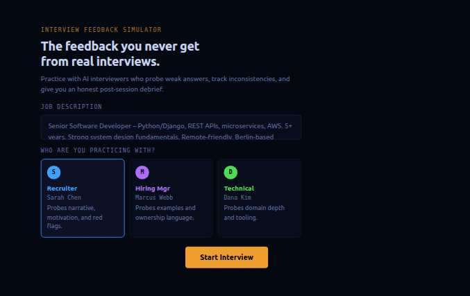

# Interview Feedback Simulator

**The feedback you never get from real interviews.**

Practice with AI interviewers who probe weak answers, track inconsistencies, and give you an honest post-session debrief. Detailed, honest, and tied to the job you applied for.



---

## What makes this different

Most interview prep tools give you a list of questions. This one reacts to what you actually say.

- Weak answers get a follow-up that pushes for specifics – not a polite move to the next topic
- Inconsistencies across your answers get noticed and flagged
- Realistic interviewer behavior: silence, pushback, and neutral reactions only
- Every question is generated from the job description you paste in
- Post-session evaluation: trait-by-trait, matched against the job description
- The interviewer's internal notes reveal what they were actually thinking at key moments
- Downloadable feedback report

## How it works

Paste a job description, pick an interviewer, and start. The AI generates questions based on your specific role and reacts dynamically to your answers.

Three interviewer personas:

| Persona | Focus |
|---|---|
| **Recruiter** (Sarah Chen) | Career narrative, motivation, red flags |
| **Hiring Manager** (Marcus Webb) | Specific examples, ownership, failure |
| **Technical** (Dana Kim) | Domain depth, tooling, practical judgment |

At the end of each session, the app generates a full feedback report including trait ratings, job description match analysis, the interviewer's internal notes, and specific things to work on.

## Prerequisites

To use this app you need an **Anthropic API key**:

1. Create a free account at [console.anthropic.com](https://console.anthropic.com)
2. In **Credits**, click **Add funds** (API access is separate from a Claude Pro subscription)
3. In the left sidebar, select **API Keys** and create a new key
4. Paste it into the **ANTHROPIC API KEY** field in the app

**Cost:** approximately $0.10–0.20 per session (10–12 exchanges + feedback report), billed directly by Anthropic.

## Getting started

No installation. Open this link in any browser and start:
https://teokitten.github.io/interview-feedback-simulator

The app runs entirely in your browser – no backend, no account, no data stored anywhere except your own device.

## Running locally

No build step required. Clone the repo and open the file:

```bash
git clone https://github.com/teokitten/interview-feedback-simulator.git
cd interview-feedback-simulator
open index.html
```

## Tech stack

Vanilla JS · Single HTML file · Anthropic API (claude-sonnet-4-6) · No frameworks · No dependencies

## License

MIT

---

Built and designed by [Teo Moldovanu](https://teokitten.github.io) · If this helped → [buy me a coffee ☕](https://ko-fi.com/teokitten)
